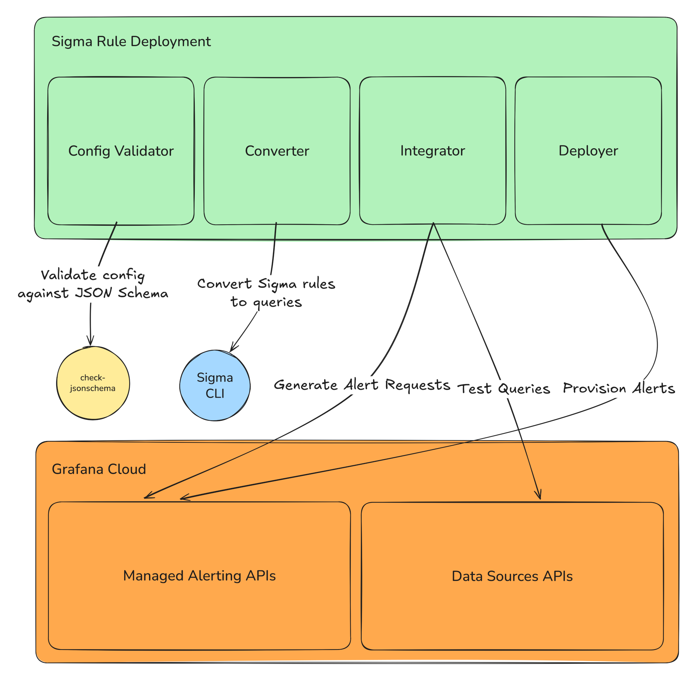
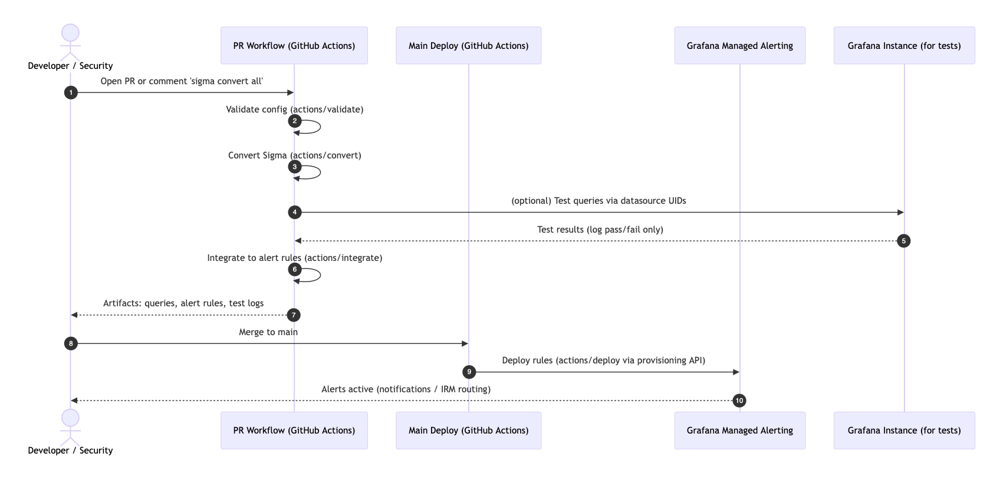

# Sigma Rule Deployment GitHub Actions Suite

Automate the conversion, testing, and deployment of [Sigma rules](https://sigmahq.io/) to [Grafana Alerting](https://grafana.com/docs/grafana/latest/alerting/) rules with GitHub Actions using a [SOCless](./README.md#what-is-socless) approach.

## Available Actions

- [Config Validator](./actions/validate/README.md): Validates configuration files against the JSON schema to ensure proper structure and required fields before processing.
- [Sigma Rule Converter](./actions/convert/README.md): Converts Sigma rules to target query languages using `sigma-cli`. Supports dynamic plugin installation, custom configurations, and output management, producing a JSON output format that can be used by the integrator.
- [Query Integrator](./actions/integrate/README.md): Given a folder of input query files (as produced by the converter), each file containing a list of queries and relevant metadata, convert each into a Grafana Managed Alerting alert rule, optionally testing the queries against a configured Grafana instance to validate that it works as expected.
- [Rule Deployer](./actions/deploy/README.md): Given a folder of Grafana Managed Alerting alert rules (as produced by the integrator), deploy them to the configured Grafana instance, using Alerting's provisioning API.

### Architecture



## Usage

1. Create a GitHub repository and add the [Sigma rules](https://sigmahq.io/docs/basics/rules.html) and [pipelines](https://sigmahq.io/docs/digging-deeper/pipelines.html) you want to convert
   - Following the main [SigmaHQ/sigma](https://github.com/SigmaHQ/sigma) convention, we put our rules into folders starting with `rules`, and we put our Sigma pipelines in a `pipelines` folder
   - Note that any [Sigma correlation rules](https://sigmahq.io/docs/meta/correlations.html) you want to convert must have the rules they reference in the same file (see [the FAQ](#faq))
2. Create a [Grafana service account token](https://grafana.com/docs/grafana/latest/administration/service-accounts/) and [add it as a secret](https://docs.github.com/en/actions/security-for-github-actions/security-guides/using-secrets-in-github-actions) to your GitHub repository
   - Ensure the service account is either an Editor and/or has the following [RBAC roles](https://grafana.com/docs/grafana/latest/administration/service-accounts/#assign-roles-to-a-service-account-in-grafana):
     - Alerting: Access to alert rules provisioning API
     - Alerting: Rules Reader
     - Alerting: Rules Writer
     - Alerting: Set provisioning status
     - Data sources: Reader
3. Create a configuration file that defines one or more conversions and add it to the repository
   - See the sample [configuration file](config/config-example.yml)
   - See also the [configuration file schema](https://github.com/grafana/sigma-rule-deployment/blob/main/config/schema.json) for more details
4. Add a workflow to run the conversion/integration Actions on a PR commit or issue comment
   - See the reusable workflow [convert-integrate.yml](.github/workflows/convert-integrate.yml)
5. Add a workflow to run the deployment Action on a push to main
   - See the reusable workflow [deploy.yml](.github/workflows/deploy.yml)
6. Create a PR that adds or modify a converted Sigma rule, and add a comment `sigma convert all` to the PR to see the conversion and integration process in action
7. Once you're happy with the results, merge the PR into main, which will trigger the deployer to provision the rules to your Grafana instance
8. With the alert rules successfully provisioned, set up [Alerting notifications](https://grafana.com/docs/grafana/latest/alerting/configure-notifications/) for the relevant folder and/or groups to directly contact affected users. Alternatively you can connect them to [Grafana IRM](https://grafana.com/docs/grafana-cloud/alerting-and-irm/irm/) and use it to manage on-call rotas and simplify alert routing

## FAQ

### What backends/data sources do you support?

These Actions can convert rules using **any** Sigma backend and produce valid alert rules for **any** data source, however, to date they have only been thoroughly tested with Loki. In particular, converting log queries into metric queries so they can be used correctly with Grafana Managed Alerting is dependent on the backend supporting that option or by modifying the generated queries.

Relevent conversion backends and data sources that can be used in Grafana include:

- [Grafana Loki](https://github.com/grafana/pySigma-backend-loki) and the [Loki data source](https://grafana.com/docs/loki/latest/)
- [Azure KQL](https://github.com/AttackIQ/pySigma-backend-kusto) and the [Azure Monitor data source](https://grafana.com/docs/grafana/latest/datasources/azure-monitor/)
- [Datadog](https://github.com/DataDog/pysigma-backend-datadog) and the [Datadog data source](https://grafana.com/grafana/plugins/grafana-datadog-datasource/)
- [Elasticsearch](https://github.com/SigmaHQ/pySigma-backend-elasticsearch) and the [Elasticsearch data source](https://grafana.com/docs/grafana/latest/datasources/elasticsearch/)
- [QRadar AQL](https://github.com/IBM/pySigma-backend-QRadar-aql) and the [IBM Security QRadar data source](https://grafana.com/grafana/plugins/ibm-aql-datasource/)
- [Opensearch](https://github.com/SigmaHQ/pySigma-backend-opensearch) and the [Opensearch data source](https://grafana.com/grafana/plugins/grafana-opensearch-datasource/)
- [Splunk](https://github.com/SigmaHQ/pySigma-backend-splunk) and the [Splunk data source](https://grafana.com/grafana/plugins/grafana-splunk-datasource/)
- [SQLite](https://github.com/SigmaHQ/pySigma-backend-sqlite) and the [SQLite data source](https://grafana.com/grafana/plugins/frser-sqlite-datasource/)
- [SurrealQL](https://github.com/SigmaHQ/pySigma-backend-surrealql) and the [SurrealDB data source](https://grafana.com/grafana/plugins/grafana-surrealdb-datasource/)

To ensure the data source plugin can execute your queries, you may need to provide a bespoke `query_model` in the conversion configuration. You do this by specifing a [fmt.Sprintf](https://pkg.go.dev/fmt#pkg-overview) formatted JSON string, which receives the following arguments:

1. the ref ID for the query
2. the UID for the data source
3. the query, escaped as a JSON string

An example query model would be:

```yaml
query_model: '{"refId":"%s","datasource":{"type":"my_data_source_type","uid":"%s"},"query":"%s","customKey":"customValue"}'
```

Other than the `refId` and `datasource` (which are required by Grafana), the keys used for the query model are data source dependent. They can be identified by testing a query against the data source with the [Query inspector](https://grafana.com/docs/grafana/latest/explore/explore-inspector/) open, going to the Query tab, and examining the items used in the `request.data.queries` list.

### Are there any restrictions on the Sigma rule files?

The main restriction are they need to be valid Sigma rules, including the `id` and `title` [metadata fields](https://sigmahq.io/docs/basics/rules.html#available-sigma-metadata-fields). If you are using [Correlation rules](https://github.com/SigmaHQ/sigma-specification/blob/main/specification/sigma-correlation-rules-specification.md), the rule files must contain **all** the referenced rules within the rule file (using [YAML's multiple document feature](https://gettaurus.org/docs/YAMLTutorial/#YAML-Multi-Documents), i.e., combined with `---`).

### How do these Actions work?



### What is SOCless?

SOCless refers to a security operations model where detection engineering and incident response workflows are fully automated through code and CI/CD pipelines. Instead of relying on manual analyst actions for converting, validating, and deploying detection rules, a SOCless system executes these tasks automatically and consistently.

This repository implements the SOCless model using GitHub Actions to manage the complete lifecycle of Sigma rules, from definition to live deployment in Grafana Managed Alerting.

The suite enables teams to:

- **Automate rule management**: Run validation, conversion, integration, and deployment automatically through GitHub Actions workflows
- **Reduce human error**: Enforce schema validation and automated testing before any rule reaches production
- **Accelerate updates**: Deploy new or modified Sigma rules within minutes of merging a pull request
- **Maintain configuration consistency**: Use version-controlled workflows and standardized pipelines to ensure reproducible deployments across environments

By shifting detection engineering into a CI/CD-driven model, the SOCless approach transforms traditional SOC operations into an automated, auditable, and scalable system, which allows security teams to focus on analysis and improvement rather than manual rule maintenance.
