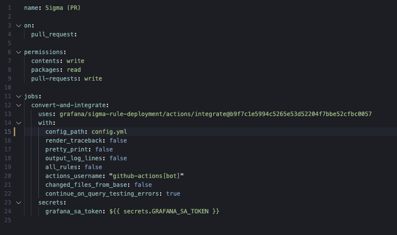

# Comment Sigma Results Action

A reusable composite GitHub Action that posts formatted comments to pull requests showing Sigma rule conversion/integration results. This action extracts rule titles from JSON files and creates user-friendly PR comments with clickable links.

## Features

- **Automatic Title Extraction**: Reads `"title"` field from JSON files and displays human-readable rule names
- **Clickable Links**: Creates links to changed files in the PR for easy navigation
- **Automatic Cleanup**: Minimizes outdated comments from previous runs
- **Customizable**: Supports custom comment titles and additional content sections
- **Reusable**: Used by both convert and integrate actions to avoid code duplication

## Usage

### Basic Example

```yaml
- name: Comment Results
  uses: ./actions/comment-sigma-results
  with:
    pull_request_number: ${{ github.event.number }}
    changed_files: ${{ steps.generate-comment-data.outputs.changed_files }}
    deleted_files: ${{ steps.generate-comment-data.outputs.deleted_files }}
    comment_title: 'Sigma Rule Conversions'
    comment_identifier: 'Sigma Rule Conversions'
    github_token: ${{ github.token }}
```

### With Additional Content

```yaml
- name: Comment Results with Test Data
  uses: ./actions/comment-sigma-results
  with:
    pull_request_number: ${{ github.event.number }}
    changed_files: ${{ steps.generate-comment-data.outputs.changed_files }}
    deleted_files: ${{ steps.generate-comment-data.outputs.deleted_files }}
    comment_title: 'Sigma Rule Integrations'
    comment_identifier: 'Sigma Rule Integrations'
    additional_content: |
      ### Test Results
      
      | Rule | Status | Count |
      | --- | --- | --- |
      | Rule 1 | ✅ Pass | 42 |
      | Rule 2 | ✅ Pass | 15 |
    github_token: ${{ github.token }}
```

## Inputs

| Input | Description | Required | Default |
|-------|-------------|----------|---------|
| `pull_request_number` | The pull request number | Yes | - |
| `changed_files` | Space-separated list of changed file paths | Yes | - |
| `deleted_files` | Space-separated list of deleted file paths | Yes | - |
| `comment_title` | Title for the comment section (e.g., "Sigma Rule Conversions") | Yes | - |
| `comment_identifier` | String to identify old comments for cleanup | Yes | - |
| `additional_content` | Optional markdown content to append to the comment | No | `''` |
| `github_token` | GitHub token for API access | Yes | - |

## How It Works

1. **Title Extraction**: For each changed file, the action parses the JSON content and extracts the `title` field (supports both top-level and nested in `rules` array)
2. **Fallback Handling**: If a title can't be found or the file can't be read, it falls back to using the filename
3. **Comment Generation**: Creates a markdown comment with:
   - Summary table showing count of changed and deleted files
   - List of changed files with extracted titles as clickable links
   - List of deleted files
   - Any additional content provided via `additional_content` input
4. **Cleanup**: Finds and minimizes any previous comments with the same identifier to keep the PR clean
5. **Posting**: Posts the new comment to the pull request

## Output Format

The generated comment looks like this:

```markdown
### Sigma Rule Conversions

| Changed | Deleted |
| --- | --- |
| 3 | 1 |

### Changed Files

- [Okta Admin MFA Reset or Deactivated](link-to-file)
- [Suspicious PowerShell Execution](link-to-file)
- [AWS CloudTrail Disabled](link-to-file)

### Deleted Files

- old_rule.json

### Test Results
(Additional content if provided)
```

## JSON Title Extraction

The action uses a JSON parser to extract the title field from JSON files. It supports two common structures:

1. **Top-level title** (for alert rule files):
```json
{
  "title": "Your Rule Title Here",
  ...
}
```

2. **Nested title in rules array** (for conversion output files):
```json
{
  "rules": [
    {
      "title": "Your Rule Title Here",
      ...
    }
  ],
  ...
}
```

The parser:
- First checks for `title` at the top level
- If not found, checks for `title` in the first rule of the `rules` array
- Falls back to the filename if no title is found

## Error Handling

The action gracefully handles errors:

- **File not found**: Falls back to filename
- **Invalid JSON**: Logs error and falls back to filename
- **No title field**: Falls back to filename (checks both top-level and `rules` array)
- **File read errors**: Logs error and falls back to filename
- **No PR found**: Logs warning and exits gracefully
- **Empty file lists**: Displays "No files changed" / "No files deleted"

## Dependencies

This action uses:
- `actions/github-script@ed597411d8f924073f98dfc5c65a23a2325f34cd` (v8.0.0)
- Node.js built-in modules: `fs`, `path`

## Used By

This action is currently used by:

- **[Sigma Rule Converter](../convert/)**: Comments conversion results
- **[Grafana Query Integrator](../integrate/)**: Comments integration results with test data

## Example PR Comment

See how this action formats comments in practice:



## Maintenance

When updating this action, remember to:

1. Test with both convert and integrate actions
2. Verify title extraction works with both JSON structures (top-level `title` and nested in `rules` array)
3. Check that old comments are properly minimized
4. Ensure additional content formatting works correctly
5. Test error handling with missing files and invalid JSON

## License

This action is part of the Sigma Rule Deployment GitHub Actions Suite.

